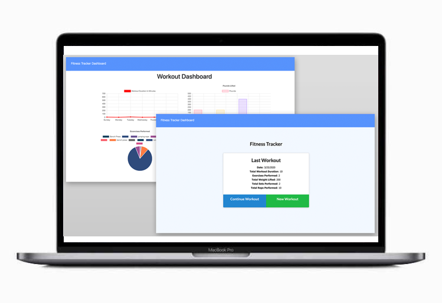

<h1 align="center">NoSQL: Workout Tracker</h1>
  

    
    
    
    
    
    

# Objective
A workout tracker using Mongo database with a Mongoose schema to handle routes with Express.

Un rastreador de entrenamiento que usa la base de datos Mongo con un esquema Mongoose para manejar rutas con Express.

# User Story
As a user, I want to be able to view create and track daily workouts. I want to be able to log multiple exercises in a workout on a given day. I should also be able to track the name, type, weight, sets, reps, and duration of exercise. If the exercise is a cardio exercise, I should be able to track my distance traveled.

Como usuario, quiero poder ver, crear y realizar un seguimiento de los entrenamientos diarios. Quiero poder registrar varios ejercicios en un entrenamiento en un día determinado. También debería poder rastrear el nombre, el tipo, el peso, las series, las repeticiones y la duración del ejercicio. Si el ejercicio es un ejercicio cardiovascular, debería poder realizar un seguimiento de la distancia recorrida.

# Technologies Used
* Javascript
* Node.js
* Express
* MongoDB
* Mongoose

# Author Informations

## [Luis Cartaya](https://github.com/cartaya1)

# Questions
✉️ Contact me with any questions: [email](mailto:cartaya1@msn.com) 
 
![GitHub:] (https://cartaya1.github.io/Workout-Traker)
![Live Demo:] (https://polar-woodland-36268.herokuapp.com/)
